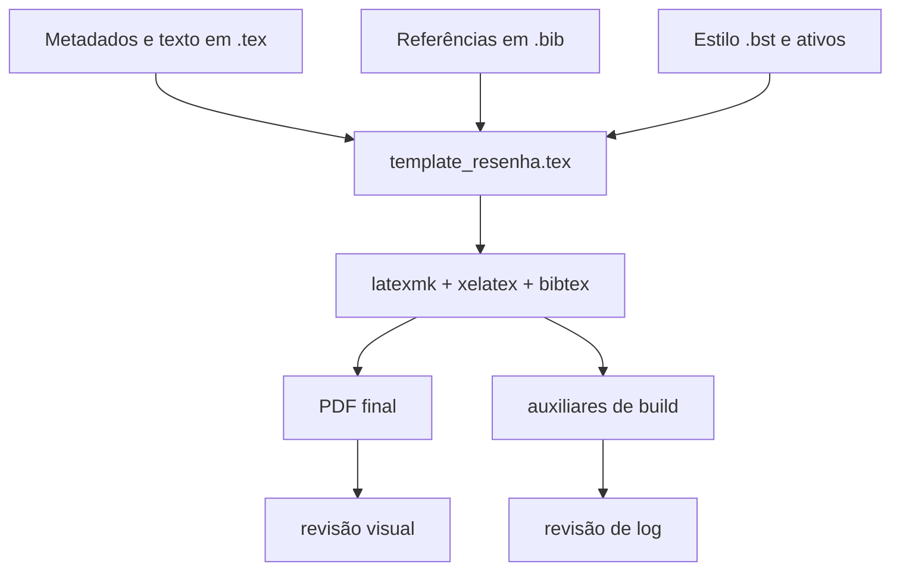

# Data Flow & Integrations

O fluxo de dados aqui é centrado em arquivos. O insumo entra como texto acadêmico, metadados e referências; percorre o template LaTeX; e sai como PDF e arquivos auxiliares de build.

## Module dependencies
- `template_resenha.tex` depende de `abntex2-alf-local.bst`, `template_resenha.bib` e `logo_uneb.png`.
- Os diretórios `tmp_*` dependem de seus próprios arquivos `.tex`, `.bib`, PDFs-fonte e, em alguns casos, cópias locais do `.bst`.
- `create_and_push_repo.sh` depende do estado Git do repositório raiz, de `.gitmodules` e de `GITHUB_TOKEN.txt`.
- `.context/docs/planning_gsd/STATE.md` depende da execução atual registrada no PRD e no workflow.

## Service layer
Não existe service layer tradicional. As responsabilidades equivalentes são:
- **Template raiz** — define a forma do documento.
- **Prompt mestre** — define o contrato de geração e revisão.
- **Automação Git** — publica raiz e submódulos.

## High-level flow
1. O autor ou agente edita `template_resenha.tex` e, quando necessário, `template_resenha.bib`.
2. XeLaTeX e BibTeX resolvem citações, sumário e referências.
3. O build produz `template_resenha.pdf` e os artefatos auxiliares locais.
4. A validação final combina revisão do log e inspeção visual do PDF.
5. Quando houver projetos derivados, o mesmo fluxo ocorre dentro de cada diretório `tmp_*` tocado no ciclo.

## Internal movement
A maior parte do movimento interno ocorre no diretório de trabalho: arquivos-fonte e auxiliares convivem lado a lado. Nos submódulos, esse mesmo padrão se repete de forma isolada.

## External integrations
- **GitHub** para versionamento remoto.
- **Git LFS** para arquivos grandes.

## Observability & failure modes
A observabilidade prática vem de `latexmk`, do arquivo `.log` e da própria inspeção do PDF. As falhas mais prováveis são: ausência de ativo relativo, erro de macro, citação quebrada, referência incompleta e drift de estilo entre o prompt mestre e o template.
